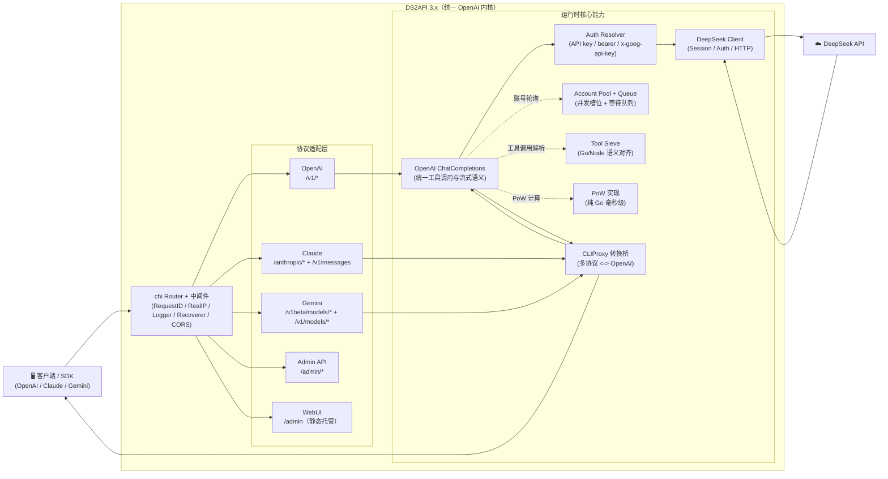

<p align="center">
  
</p>

# DS2API

[](LICENSE)


[](https://github.com/CJackHwang/ds2api/releases)
[](docs/DEPLOY.md)
[](https://zeabur.com/templates/L4CFHP)
[](https://vercel.com/new/clone?repository-url=https://github.com/CJackHwang/ds2api)

语言 / Language: [中文](README.MD) | [English](README.en.md)

将 DeepSeek Web 对话能力转换为 OpenAI、Claude 与 Gemini 兼容 API。后端为 **Go 全量实现**，前端为 React WebUI 管理台（源码在 `webui/`，部署时自动构建到 `static/admin`）。

文档入口：[文档导航](docs/README.md) / [架构说明](docs/ARCHITECTURE.md) / [接口文档](API.md)

【感谢Linux.do社区及GitHub社区各位开发者对项目的支持与贡献】

> **重要免责声明**
>
> 本仓库仅供学习、研究、个人实验和内部验证使用，不提供任何形式的商业授权、适用性保证或结果保证。
>
> 作者及仓库维护者不对因使用、修改、分发、部署或依赖本项目而产生的任何直接或间接损失、账号封禁、数据丢失、法律风险或第三方索赔负责。
>
> 请勿将本项目用于违反服务条款、协议、法律法规或平台规则的场景。商业使用前请自行确认 `LICENSE`、相关协议以及你是否获得了作者的书面许可。

## 架构概览（摘要）



详细架构拆分与目录职责见 [docs/ARCHITECTURE.md](docs/ARCHITECTURE.md)。

- **后端**：Go（`cmd/ds2api/`、`api/`、`internal/`），不依赖 Python 运行时
- **前端**：React 管理台（`webui/`），运行时托管静态构建产物
- **部署**：本地运行、Docker、Vercel Serverless、Linux systemd

## 核心能力

| 能力 | 说明 |
| --- | --- |
| OpenAI 兼容 | `GET /v1/models`、`GET /v1/models/{id}`、`POST /v1/chat/completions`、`POST /v1/responses`、`GET /v1/responses/{response_id}`、`POST /v1/embeddings`、`POST /v1/files` |
| Claude 兼容 | `GET /anthropic/v1/models`、`POST /anthropic/v1/messages`、`POST /anthropic/v1/messages/count_tokens`（及快捷路径 `/v1/messages`、`/messages`） |
| Gemini 兼容 | `POST /v1beta/models/{model}:generateContent`、`POST /v1beta/models/{model}:streamGenerateContent`（及 `/v1/models/{model}:*` 路径） |
| 统一 CORS 兼容 | `/v1/*`、`/anthropic/*`、`/v1beta/models/*`、`/admin/*` 统一走同一套 CORS 策略；Vercel 上 `/v1/chat/completions` 的 Node Runtime 也对齐相同放行规则，尽量减少第三方预检请求头限制 |
| 多账号轮询 | 自动 token 刷新、邮箱/手机号双登录方式 |
| 并发队列控制 | 每账号 in-flight 上限 + 等待队列，动态计算建议并发值 |
| DeepSeek PoW | 纯 Go 高性能实现（DeepSeekHashV1），毫秒级响应 |
| Tool Calling | 防泄漏处理：非代码块高置信特征识别、`delta.tool_calls` 早发、结构化增量输出 |
| Admin API | 配置管理、运行时设置热更新、代理管理、账号测试 / 批量测试、会话清理、导入导出、Vercel 同步、版本检查 |
| WebUI 管理台 | `/admin` 单页应用（中英文双语、深色模式，支持查看服务器端对话记录） |
| 运维探针 | `GET /healthz`（存活）、`GET /readyz`（就绪） |

## 平台兼容矩阵

| 级别 | 平台 | 当前状态 |
| --- | --- | --- |
| P0 | Codex CLI/SDK（`wire_api=chat` / `wire_api=responses`） | ✅ |
| P0 | OpenAI SDK（JS/Python，chat + responses） | ✅ |
| P0 | Vercel AI SDK（openai-compatible） | ✅ |
| P0 | Anthropic SDK（messages） | ✅ |
| P0 | Google Gemini SDK（generateContent） | ✅ |
| P1 | LangChain / LlamaIndex / OpenWebUI（OpenAI 兼容接入） | ✅ |

## 模型支持

### OpenAI 接口（`GET /v1/models`）

| 模型类型 | 模型 ID | thinking | search |
| --- | --- | --- | --- |
| default | `deepseek-v4-flash` | 默认开启，可由请求参数控制 | ❌ |
| expert | `deepseek-v4-pro` | 默认开启，可由请求参数控制 | ❌ |
| default | `deepseek-v4-flash-search` | 默认开启，可由请求参数控制 | ✅ |
| expert | `deepseek-v4-pro-search` | 默认开启，可由请求参数控制 | ✅ |
| vision | `deepseek-v4-vision` | 默认开启，可由请求参数控制 | ❌ |
| vision | `deepseek-v4-vision-search` | 默认开启，可由请求参数控制 | ✅ |

除原生模型外，也支持常见 alias 输入（如 `gpt-5.5`、`gpt-5.4`、`gpt-5.4-mini`、`gpt-5.3-codex`、`gpt-4.1`、`o3`、`claude-opus-4-6`、`claude-sonnet-4-6`、`gemini-2.5-pro`、`gemini-2.5-flash` 等），但 `/v1/models` 返回的是规范化后的 DeepSeek 原生模型 ID。

### Claude 接口（`GET /anthropic/v1/models`）

| 当前常用模型 | 默认映射 |
| --- | --- |
| `claude-sonnet-4-6` | `deepseek-v4-flash` |
| `claude-haiku-4-5`（兼容 `claude-3-5-haiku-latest`） | `deepseek-v4-flash` |
| `claude-opus-4-6` | `deepseek-v4-pro` |

可通过配置中的 `model_aliases` 覆盖映射关系。
`/anthropic/v1/models` 除上述当前主别名外，还会返回 Claude 4.x snapshots，以及 3.x 历史模型 ID 与常见 alias，便于旧客户端直接兼容。

> 截至 2026-04-26：Anthropic 官方模型页当前主推 `claude-opus-4-6`、`claude-sonnet-4-6`、`claude-haiku-4-5`；OpenAI 官方开发者模型页当前推荐从 `gpt-5.5` 开始，ChatGPT Help Center 当前主打 `GPT-5.3 Instant / GPT-5.5 Thinking / GPT-5.5 Pro`。本文档中的 alias 示例按“兼容客户端会传来的最新官方模型 ID”维护。

#### Claude Code 接入避坑（实测）

- `ANTHROPIC_BASE_URL` 推荐直接指向 DS2API 根地址（例如 `http://127.0.0.1:5001`），Claude Code 会请求 `/v1/messages?beta=true`。
- `ANTHROPIC_API_KEY` 需要与 `config.json` 中 `keys` 一致；建议同时保留常规 key 与 `sk-ant-*` 形态 key，兼容不同客户端校验习惯。
- 若系统设置了代理，建议对 DS2API 地址配置 `NO_PROXY=127.0.0.1,localhost,<你的主机IP>`，避免本地回环请求被代理拦截。
- 如遇“工具调用输出成文本、未执行”问题，请优先检查模型输出是否为受支持的 XML/Markup 工具块（例如 `<tool_call>` / `<function_call>` / `<invoke>` / `tool_use`），而不是纯 JSON `tool_calls` 片段。

### Gemini 接口

Gemini 适配器将模型名通过 `model_aliases` 或内置规则映射到 DeepSeek 原生模型，支持 `generateContent` 和 `streamGenerateContent` 两种调用方式，并完整支持 Tool Calling（`functionDeclarations` → `functionCall` 输出）。

## 快速开始

### 部署方式优先级建议

推荐按以下顺序选择部署方式：

1. **下载 Release 构建包运行**：最省事，产物已编译完成，最适合大多数用户。
2. **Docker / GHCR 镜像部署**：适合需要容器化、编排或云环境部署。
3. **Vercel 部署**：适合已有 Vercel 环境且接受其平台约束的场景。
4. **本地源码运行 / 自行编译**：适合开发、调试或需要自行修改代码的场景。

### 通用第一步（所有部署方式）

把 `config.json` 作为唯一配置源（推荐做法）：

```bash
cp config.example.json config.json
# 编辑 config.json
```

后续部署建议：
- 本地运行：直接读取 `config.json`
- Docker / Vercel：由 `config.json` 生成 `DS2API_CONFIG_JSON`（Base64）注入环境变量，也可以直接写原始 JSON

WebUI 管理台里的“全量配置模板”也直接复用同一份 `config.example.json`，所以更新示例文件后，前端模板会自动保持一致。

### 方式一：下载 Release 构建包

每次发布 Release 时，GitHub Actions 会自动构建多平台二进制包：

```bash
# 下载对应平台的压缩包后
tar -xzf ds2api_<tag>_linux_amd64.tar.gz
cd ds2api_<tag>_linux_amd64
cp config.example.json config.json
# 编辑 config.json
./ds2api
```

### 方式二：Docker 运行

```bash
# 1. 准备环境变量和配置文件
cp .env.example .env
cp config.example.json config.json

# 2. 编辑 .env（至少设置 DS2API_ADMIN_KEY；如需修改宿主机端口，可额外设置 DS2API_HOST_PORT）
#    DS2API_ADMIN_KEY=请替换为强密码

# 3. 启动
docker-compose up -d

# 4. 查看日志
docker-compose logs -f
```

默认 `docker-compose.yml` 会把宿主机 `6011` 映射到容器内的 `5001`。如果你希望直接对外暴露 `5001`，请设置 `DS2API_HOST_PORT=5001`（或者手动调整 `ports` 配置）。

更新镜像：`docker-compose up -d --build`

#### Zeabur 一键部署（Dockerfile）

1. 点击上方 “Deploy on Zeabur” 按钮，一键部署。
2. 部署完成后访问 `/admin`，使用 Zeabur 环境变量/模板指引中的 `DS2API_ADMIN_KEY` 登录。
3. 在管理台导入/编辑配置（会写入并持久化到 `/data/config.json`）。

说明：Zeabur 使用仓库内 `Dockerfile` 直接构建时，不需要额外传入 `BUILD_VERSION`；镜像会优先读取该构建参数，未提供时自动回退到仓库根目录的 `VERSION` 文件。

### 方式三：Vercel 部署

1. Fork 仓库到自己的 GitHub
2. 在 Vercel 上导入项目
3. 配置环境变量（最少设置 `DS2API_ADMIN_KEY`；推荐同时设置 `DS2API_CONFIG_JSON`）
4. 部署

建议先在仓库目录复制模板并填写：

```bash
cp config.example.json config.json
# 编辑 config.json
```

推荐：先本地把 `config.json` 转成 Base64，再粘贴到 `DS2API_CONFIG_JSON`，避免 JSON 格式错误：

```bash
base64 < config.json | tr -d '\n'
```

> **流式说明**：`/v1/chat/completions` 在 Vercel 上默认走 `api/chat-stream.js`（Node Runtime）以保证实时 SSE。鉴权、账号选择、会话/PoW 准备仍由 Go 内部 prepare 接口完成；流式响应（含 `tools`）在 Node 侧执行与 Go 对齐的输出组装与防泄漏处理。虽然这里只有 OpenAI chat 流式走 Node，但 CORS 放行策略仍与 Go 主路由保持一致，统一覆盖第三方客户端预检场景。

详细部署说明请参阅 [部署指南](docs/DEPLOY.md)。

### 方式四：本地源码运行

**前置要求**：Go 1.26+，Node.js `20.19+` 或 `22.12+`（仅在需要构建 WebUI 时）

```bash
# 1. 克隆仓库
git clone https://github.com/CJackHwang/ds2api.git
cd ds2api

# 2. 配置
cp config.example.json config.json
# 编辑 config.json，填入你的 DeepSeek 账号信息和 API key

# 3. 启动
go run ./cmd/ds2api
```

默认本地访问地址：`http://127.0.0.1:5001`

服务实际绑定：`0.0.0.0:5001`，因此同一局域网设备通常也可以通过你的内网 IP 访问。

> **WebUI 自动构建**：本地首次启动时，若 `static/admin` 不存在，会自动尝试执行 `npm ci`（仅在缺少依赖时）和 `npm run build -- --outDir static/admin --emptyOutDir`（需要本机有 Node.js）。你也可以手动构建：`./scripts/build-webui.sh`

## 配置说明

### `config.json` 示例

```json
{
  "keys": ["your-api-key-1", "your-api-key-2"],
  "api_keys": [
    {
      "key": "your-api-key-1",
      "name": "主 Key",
      "remark": "生产流量"
    }
  ],
  "accounts": [
    {
      "name": "账号 A",
      "remark": "主账号",
      "email": "user@example.com",
      "password": "your-password"
    },
    {
      "mobile": "12345678901",
      "password": "your-password"
    }
  ],
  "model_aliases": {
    "gpt-4o": "deepseek-v4-flash",
    "gpt-5.5": "deepseek-v4-flash",
    "gpt-5.4-mini": "deepseek-v4-flash",
    "gpt-5.3-codex": "deepseek-v4-pro",
    "o3": "deepseek-v4-pro",
    "claude-opus-4-6": "deepseek-v4-pro",
    "gemini-2.5-flash": "deepseek-v4-flash"
  },
  "compat": {
    "wide_input_strict_output": true,
    "strip_reference_markers": true
  },
  "responses": {
    "store_ttl_seconds": 900
  },
  "embeddings": {
    "provider": "deterministic"
  },
  "admin": {
    "jwt_expire_hours": 24
  },
  "runtime": {
    "account_max_inflight": 2,
    "account_max_queue": 0,
    "global_max_inflight": 0,
    "token_refresh_interval_hours": 6
  },
  "auto_delete": {
    "mode": "none"
  }
}
```

- `keys`：API 访问密钥列表，客户端通过 `Authorization: Bearer <key>` 鉴权
- `api_keys`：推荐使用的新结构化密钥列表，支持 `key` + `name` + `remark`（`keys` 仍兼容）
- `accounts`：DeepSeek 账号列表，支持 `email` 或 `mobile` 登录；可额外填写 `name` / `remark` 便于管理
- `token`：配置文件中即使填写也会在加载时被清空（不会从 `config.json` 读取 token）；实际 token 仅在运行时内存中维护并自动刷新
- `model_aliases`：常见模型名（如 GPT/Codex/Claude）到 DeepSeek 模型的映射
- `compat.wide_input_strict_output`：建议保持 `true`（当前实现默认宽进严出）
- `compat.strip_reference_markers`：建议保持 `true`，用于清理可见输出中的引用/标记
- `toolcall`：旧字段，当前实现已固定为特征匹配 + 高置信早发；即使保留在配置里也会被忽略
- `responses.store_ttl_seconds`：`/v1/responses/{id}` 的内存缓存 TTL
- `embeddings.provider`：embedding 提供方（当前内置 `deterministic/mock/builtin`）
- `model_aliases`：全局统一模型映射表，OpenAI / Claude / Gemini 共用；项目内只维护这一套映射入口
- `admin`：管理后台设置（JWT 过期时间、密码哈希等），可通过 Admin Settings API 热更新
- `runtime`：运行时参数（并发限制、队列大小、托管账号 token 刷新间隔），可通过 Admin Settings API 热更新；`account_max_queue=0`/`global_max_inflight=0` 表示按推荐值自动计算，`token_refresh_interval_hours=6` 为默认强制重登间隔
- `auto_delete.mode`：请求结束后如何清理 DeepSeek 远端聊天记录，支持 `none`（默认，不删除）、`single`（仅删除当前会话）、`all`（清空全部会话）；旧配置里的 `auto_delete.sessions=true` 仍会被视为 `all`

### 环境变量

> 建议：长期维护请优先以 `config.json`（或其 Base64）为单一配置源。环境变量仅保留部署必需项；`DS2API_CONFIG_JSON` 主要用于 Vercel/无持久盘场景，后续可能进一步收敛。

| 变量 | 用途 | 默认值 |
| --- | --- | --- |
| `PORT` | 服务端口 | `5001` |
| `LOG_LEVEL` | 日志级别 | `INFO`（可选：`DEBUG`/`WARN`/`ERROR`） |
| `DS2API_ADMIN_KEY` | Admin 登录密钥 | `admin` |
| `DS2API_JWT_SECRET` | Admin JWT 签名密钥 | 等同 `DS2API_ADMIN_KEY` |
| `DS2API_JWT_EXPIRE_HOURS` | Admin JWT 过期小时数 | `24` |
| `DS2API_CONFIG_PATH` | 配置文件路径 | `config.json` |
| `DS2API_CONFIG_JSON` | 直接注入配置（JSON 或 Base64） | — |
| `DS2API_CHAT_HISTORY_PATH` | 服务器端对话记录文件路径 | `data/chat_history.json` |
| `DS2API_ENV_WRITEBACK` | 环境变量模式下自动写回配置文件并切换文件模式（`1/true/yes/on`） | 关闭 |
| `DS2API_STATIC_ADMIN_DIR` | 管理台静态文件目录 | `static/admin` |
| `DS2API_AUTO_BUILD_WEBUI` | 启动时自动构建 WebUI | 本地开启，Vercel 关闭 |
| `DS2API_DEV_PACKET_CAPTURE` | 本地开发抓包开关（记录最近会话请求/响应体） | 本地非 Vercel 默认开启 |
| `DS2API_DEV_PACKET_CAPTURE_LIMIT` | 本地抓包保留条数（超出自动淘汰） | `20` |
| `DS2API_DEV_PACKET_CAPTURE_MAX_BODY_BYTES` | 单条响应体最大记录字节数 | `5242880` |
| `DS2API_ACCOUNT_MAX_INFLIGHT` | 每账号最大并发 in-flight 请求数 | `2` |
| `DS2API_ACCOUNT_MAX_QUEUE` | 等待队列上限 | `recommended_concurrency` |
| `DS2API_GLOBAL_MAX_INFLIGHT` | 全局最大 in-flight 请求数 | `recommended_concurrency` |
| `DS2API_VERCEL_INTERNAL_SECRET` | Vercel 混合流式内部鉴权密钥 | 回退用 `DS2API_ADMIN_KEY` |
| `DS2API_VERCEL_STREAM_LEASE_TTL_SECONDS` | 流式 lease 过期秒数 | `900` |
| `VERCEL_TOKEN` | Vercel 同步 token | — |
| `VERCEL_PROJECT_ID` | Vercel 项目 ID | — |
| `VERCEL_TEAM_ID` | Vercel 团队 ID | — |
| `DS2API_VERCEL_PROTECTION_BYPASS` | Vercel 部署保护绕过密钥（内部 Node→Go 调用） | — |

> 提示：当检测到 `DS2API_CONFIG_JSON` 时，管理台会显示当前模式风险与自动持久化状态（含 `DS2API_CONFIG_PATH` 路径与模式切换说明）。

#### 必填 / 可选（按部署方式）

- **所有部署都必填**：`DS2API_ADMIN_KEY`
- **配置来源二选一（推荐前者）**：
  - `config.json` 文件（推荐，持久化更直观）
  - `DS2API_CONFIG_JSON`（可选，适合 Vercel；支持 JSON 或 Base64）
- **仅在环境变量配置模式建议开启**：`DS2API_ENV_WRITEBACK=1`（避免管理台改动重启后丢失）
- 其余环境变量均为可选调优项。

## 鉴权模式

调用业务接口（`/v1/*`、`/anthropic/*`、Gemini 路由）时支持两种模式：

| 模式 | 说明 |
| --- | --- |
| **托管账号模式** | `Bearer` 或 `x-api-key` 传入 `config.keys` 中的 key，由服务自动轮询选择账号 |
| **直通 token 模式** | 传入 token 不在 `config.keys` 中时，直接作为 DeepSeek token 使用 |

可选请求头 `X-Ds2-Target-Account`：指定使用某个托管账号（值为 email 或 mobile）。
Gemini 路由还可以使用 `x-goog-api-key`，或在没有认证头时使用 `?key=` / `?api_key=` 作为调用方凭据。

## 并发模型

```
每账号可用并发 = DS2API_ACCOUNT_MAX_INFLIGHT（默认 2）
建议并发值 = 账号数量 × 每账号并发上限
等待队列上限 = DS2API_ACCOUNT_MAX_QUEUE（默认 = 建议并发值）
429 阈值 = in-flight + 等待队列 ≈ 账号数量 × 4
```

- 当 in-flight 槽位满时，请求进入等待队列，**不会立即 429**
- 超出总承载上限后才返回 `429 Too Many Requests`
- `GET /admin/queue/status` 返回实时并发状态

## Tool Call 适配

当请求中带 `tools` 时，DS2API 会做防泄漏处理与结构化转译：

1. 只在**非代码块上下文**启用执行型 toolcall 识别（代码块示例默认不触发）
2. 解析层当前以 XML/Markup 家族为准（`<tool_call>` / `<function_call>` / `<invoke>` / `tool_use` / antml 变体）；纯 JSON `tool_calls` 片段默认不作为可执行调用解析
3. `responses` 流式严格使用官方 item 生命周期事件（`response.output_item.*`、`response.content_part.*`、`response.function_call_arguments.*`）
4. `responses` 支持并执行 `tool_choice`（`auto`/`none`/`required`/强制函数）；`required` 违规时非流式返回 `422`，流式返回 `response.failed`
5. 客户端请求哪种协议，就按该协议返回工具调用（OpenAI/Claude/Gemini 各自原生结构）；模型侧优先约束输出规范 XML，再由兼容层转译

> 说明：当前版本在 parser 层仍以“尽量解析成功”为优先，未启用基于 allow-list 的工具名硬拒绝。
>
> 想评估“把工具调用封装成 XML 再输入模型”的方案，可参考：`docs/toolcall-semantics.md`。

## 本地开发抓包工具

用于定位「responses 思考流/工具调用」等问题。开启后会自动记录最近 N 条 DeepSeek 对话上游请求体与响应体（默认 20 条，超出自动淘汰；单条响应体默认最多记录 5 MB）。

启用示例：

```bash
DS2API_DEV_PACKET_CAPTURE=true \
DS2API_DEV_PACKET_CAPTURE_LIMIT=20 \
go run ./cmd/ds2api
```

查询/清空（需 Admin JWT）：

- `GET /admin/dev/captures`：查看抓包列表（最新在前）
- `DELETE /admin/dev/captures`：清空抓包
- `GET /admin/dev/raw-samples/query?q=关键词&limit=20`：按问题关键词查询当前内存抓包，并按 `chat_session_id` 归并 `completion + continue` 链
- `POST /admin/dev/raw-samples/save`：把命中的某条抓包链保存为 `tests/raw_stream_samples/<sample-id>/` 回放样本

返回字段包含：

- `request_body`：发送给 DeepSeek 的完整请求体
- `response_body`：上游返回的原始流式内容拼接文本
- `response_truncated`：是否触发单条大小截断

保存接口支持用 `query`、`chain_key` 或 `capture_id` 选中目标。例如：

```json
{"query":"广州天气","sample_id":"gz-weather-from-memory"}
```

## 文档索引

| 文档 | 说明 |
| --- | --- |
| [API.md](API.md) / [API.en.md](API.en.md) | API 接口文档（含请求/响应示例） |
| [DEPLOY.md](docs/DEPLOY.md) / [DEPLOY.en.md](docs/DEPLOY.en.md) | 部署指南（本地/Docker/Vercel/systemd） |
| [CONTRIBUTING.md](docs/CONTRIBUTING.md) / [CONTRIBUTING.en.md](docs/CONTRIBUTING.en.md) | 贡献指南 |
| [TESTING.md](docs/TESTING.md) | 测试集使用指南 |

## 测试

```bash
# 单元测试（Go + Node）
./tests/scripts/run-unit-all.sh

# 一键端到端全链路测试（真实账号，生成完整请求/响应日志）
./tests/scripts/run-live.sh

# 或自定义参数
go run ./cmd/ds2api-tests \
  --config config.json \
  --admin-key admin \
  --out artifacts/testsuite \
  --timeout 120 \
  --retries 2
```

```bash
# 发布前阻断门禁
./tests/scripts/check-stage6-manual-smoke.sh
./tests/scripts/check-refactor-line-gate.sh
./tests/scripts/run-unit-all.sh
npm ci --prefix webui && npm run build --prefix webui
```

## 测试

详细测试指南请参阅 [docs/TESTING.md](docs/TESTING.md)。

### 快速测试命令

```bash
# 运行所有单元测试
go test ./...

# 运行 tool calls 相关测试（调试工具调用问题）
go test -v -run 'TestParseToolCalls|TestRepair' ./internal/toolcall/

# 运行端到端测试
./tests/scripts/run-live.sh
```

## Release 自动构建（GitHub Actions）

工作流文件：`.github/workflows/release-artifacts.yml`

- **触发条件**：仅在 GitHub Release `published` 时触发（普通 push 不会触发）
- **构建产物**：多平台二进制包（`linux/amd64`、`linux/arm64`、`darwin/amd64`、`darwin/arm64`、`windows/amd64`）+ `sha256sums.txt`
- **容器镜像发布**：仅推送到 GHCR（`ghcr.io/cjackhwang/ds2api`）
- **每个压缩包包含**：`ds2api` 可执行文件、`static/admin`、WASM 文件（同时支持内置 fallback）、`config.example.json` 配置示例、README、LICENSE

## 免责声明

本项目基于逆向方式实现，仅供学习、研究、个人实验和内部验证使用，不提供任何商业授权、稳定性保证或可用性保证。
作者及仓库维护者不对因使用、修改、分发、部署或依赖本项目而产生的任何直接或间接损失、账号封禁、数据丢失、法律风险或第三方索赔负责。

请勿将本项目用于违反服务条款、协议、法律法规或平台规则的场景。商业使用前请自行确认 `LICENSE`、相关协议以及你是否获得了作者的书面许可。
